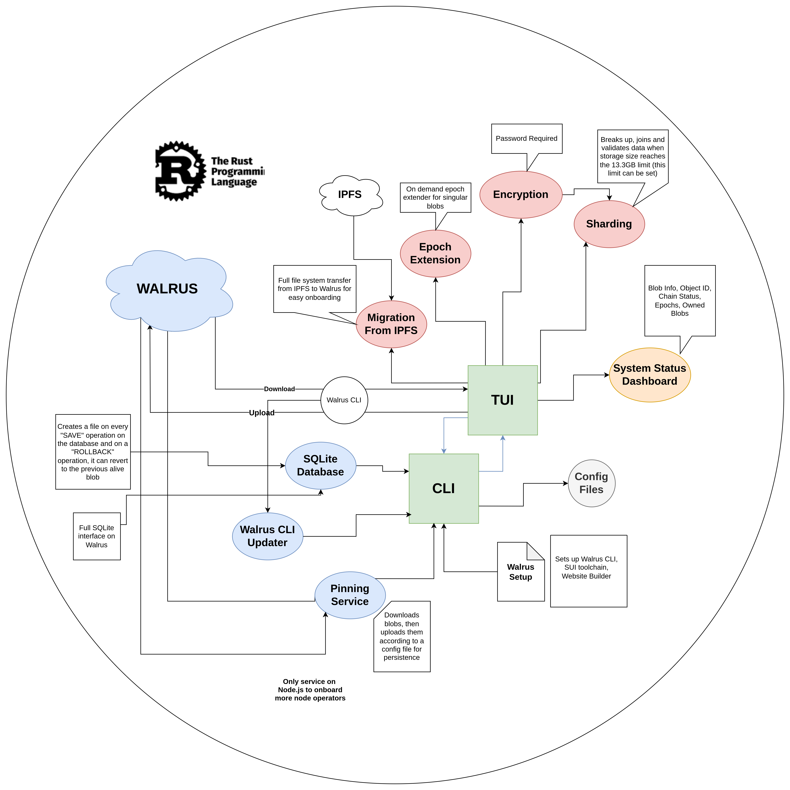

# WalTer Core DevTools

WalTer Core DevTools is a collection of tools made for the Walrus file storage network written completely in Rust.

## Features

| Feature            | Description                                             |
| ------------------ | ------------------------------------------------------- |
| 🔄 Sharding        | Advanced file sharding support for handling large files |
| 🔒 Encryption      | End-to-end file encryption and decryption               |
| ✅ Verification    | Robust file integrity verification system               |
| 📦 Auto-Update     | Automated Walrus binary updates                         |
| ⏰ Epoch Extension | Extend your storage duration with Epoch Extender        |
| 🔄 Migration       | One-click migration from other IPFS providers           |
| 📌 HTTP Pinning    | Node.js based HTTP Pinning service                      |
| 🛢️ Database        | Always available SQLite which supports rollbacks        |
| 🏗️ Site-builder    | Easy install and usage access for Site-Builder          |

# WalTer UI

WalTer-UI is a **terminal-based** Devtool toolchain built on Rust. It leverages the power of `crossterm` for terminal handling, `ratatui` for building rich terminal UIs, and `reqwest` for making HTTP requests. This project brings together the larger WalTer ecosystem, which includes functionalities provided by the meticulously tested and modular WalTer-Core library.

## Getting Started

### Prerequisites

- Rust and Cargo installed on your system.

### 📦 Installation

1.  Clone the repository:

    ```bash
    git clone https://github.com/EthIndia2024IITR/walter-ui.git
    ```

2.  Install from Makefile:

    ```bash
    cd walter-ui;
    ```

3.  Run the project:

    ```bash
    cargo build && cargo run

    ```

4.  You can access the CLI by using the --help flag

## Instructions

## CLI Options

### `--help` | `-h`

Prints the help message with usage instructions and available options.

### `--cli` | `-c`

Enables CLI mode for Walter UI.

### `--setup` | `-s`

Sets up Walter along with Walrus CLI, Walrus Site Builder, and Sui Client.

### `--update` | `-u`

Updates Walter and its dependencies.

### `--sqlite` | `-sql`

Runs the Walrus SQLite shell with rollbacks. Requires `blobID` as an argument.

-

### 1. Splash Screen

- `Enter` key to get into the dashboard and use the arrow keys to navigate here. Use the number keys to navigate between screens and check for instructions on the bottom part of the screen.

### 2. Dashboard

- Contains descriptive System and Blob Information
- Users can view the expiry epoch of their blobs
- Shows all blobs associated with a users `sui` account

### 3. Uploader

- Can be used to upload individual files

### 4. Migrate from IPFS

- **Users can migrate their existing filesystem completely from IPFS to Walrus.**

### 5. Sharding with Encryption and Epoch Extension

- Users can send their large databases to Walrus by breaking them into 13.3 GB chunks (which is the max size that Walrus supports).
- Also supports encryption.

- **Quit Application**: Press `q` to initiate quit, then `y` to confirm or `n` to cancel.
- **Navigation**:
  - Use the footer to see all the navigation information.

## System Architecture

### All that we built, in a glance


